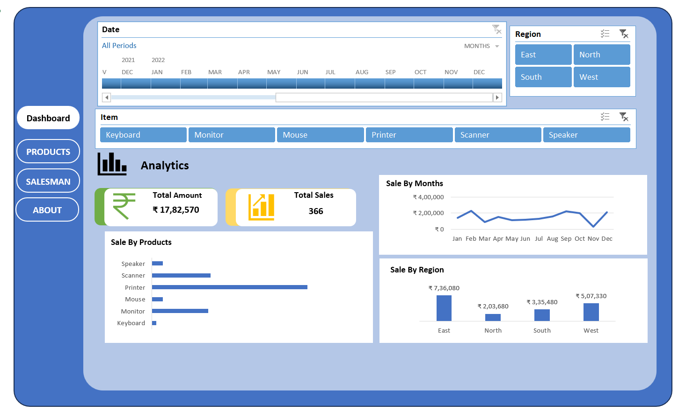

# 📊 Sales Dashboard in Microsoft Excel

## Overview

The **Sales Dashboard** is an interactive Microsoft Excel project designed to analyze sales performance and provide actionable business insights. It leverages Pivot Tables, Pivot Charts, Slicers, and KPI cards to transform raw sales data into an easy-to-understand dashboard for decision-making.

## Objectives

* Analyze overall sales performance.
* Monitor revenue, profit, and order trends.
* Compare sales across regions and product categories.
* Identify top-performing products and sales representatives.
* Present key business metrics through an interactive dashboard.

## Dashboard Features

* 📈 Total Sales KPI
* 💰 Total Profit KPI
* 📦 Total Orders KPI
* 🌍 Region-wise Sales Analysis
* 🛍️ Category-wise Sales Performance
* 📅 Monthly Sales Trend
* 🏆 Top Performing Products
* 🎛️ Interactive Slicers for dynamic filtering
* 📊 Pivot Charts and Pivot Tables

## Tools & Skills Used

* Microsoft Excel
* Data Cleaning
* Pivot Tables
* Pivot Charts
* Slicers
* KPI Cards
* Conditional Formatting
* Excel Functions
* Data Visualization
* Business Reporting

## Dashboard Preview

> Replace the image below with your dashboard screenshot.



## Files Included

| File                   | Description                                                                                              |
| ---------------------- | -------------------------------------------------------------------------------------------------------- |
| `Sales_Dashboard.xlsx` | Complete Excel workbook containing the dataset, Pivot Tables, charts, slicers, and interactive dashboard |
| `dashboard.png`        | Screenshot of the final dashboard                                                                        |
| `README.md`            | Project documentation                                                                                    |

## Key Insights

* Monitored overall sales, profit, and order performance.
* Compared sales across different regions and product categories.
* Identified top-performing products based on sales.
* Analyzed monthly sales trends to understand business performance over time.
* Enabled interactive filtering using slicers for better data exploration.

## Learning Outcomes

Through this project, I strengthened my skills in:

* Data Cleaning and Preparation
* Data Analysis in Microsoft Excel
* Interactive Dashboard Design
* KPI Reporting
* Business Insight Generation
* Data Visualization Best Practices

## Repository Structure

```text
Sales-Dashboard-Excel/
│
├── Sales_Dashboard.xlsx
├── dashboard.png
└── README.md
```

## Author

**Siddharth**

Aspiring Data Analyst passionate about transforming data into meaningful insights using Excel, SQL, Python, and Power BI.

